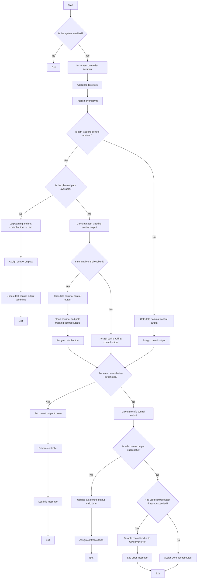

# deformable_manipulations_tent_building

## Velocity Controller

### calculate_control_outputs_timer_callback

```mermaid
graph TD
    A[Start] --> B{Is the system enabled?}
    B -->|No| C[Exit]
    B -->|Yes| D[Increment controller iteration]
    D --> E[Calculate tip errors]
    E --> F[Publish error norms]
    F --> G{Is path tracking control enabled?}
    
    G -->|Yes| H{Is the planned path available?}
    H -->|No| I[Log warning and set control output to zero]
    I --> J[Assign control outputs]
    J --> K[Update last control output valid time]
    K --> L[Exit]
    
    H -->|Yes| M[Calculate path tracking control output]
    M --> N{Is nominal control enabled?}
    
    N -->|Yes| O[Calculate nominal control output]
    O --> P[Blend nominal and path tracking control outputs]
    P --> Q[Assign control output]
    
    N -->|No| R[Assign path tracking control output]
    
    G -->|No| S[Calculate nominal control output]
    S --> T[Assign control output]
    
    Q --> U{Are error norms below thresholds?}
    R --> U
    T --> U
    
    U -->|Yes| V[Set control output to zero]
    V --> W[Disable controller]
    W --> X[Log info message]
    X --> Y[Exit]
    
    U -->|No| Z[Calculate safe control output]
    Z --> AA{Is safe control output successful?}
    AA -->|Yes| AB[Update last control output valid time]
    AB --> AC[Assign control outputs]
    AC --> AD[Exit]
    
    AA -->|No| AE{Has valid control output timeout exceeded?}
    AE -->|Yes| AF[Disable controller due to QP solver error]
    AF --> AG[Log error message]
    AE -->|No| AH[Assign zero control output]
    AG --> AI[Exit]
    AH --> AI
```

